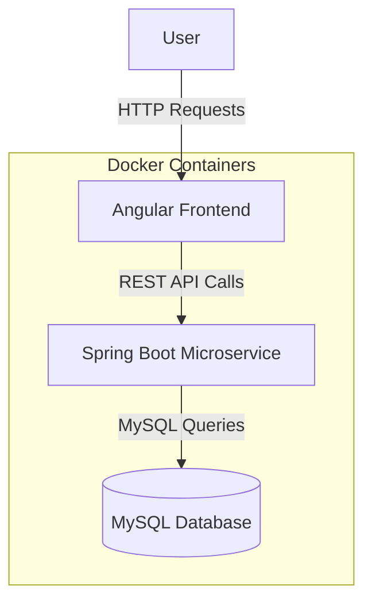

# Full Stack Angular Spring Boot Ecommerce Application

Full Stack E-commerce application with Angular front-end and Spring Boot back-end

##  Architecture

```mermaid

graph TD
    A[User] -->|HTTP Requests| B[Angular Frontend]
    B -->|REST API Calls| C[Spring Boot Microservice]
    C -->|MySQL Queries| D[(MySQL Database)]

    subgraph Docker Containers
        B
        C
        D
    end

```
